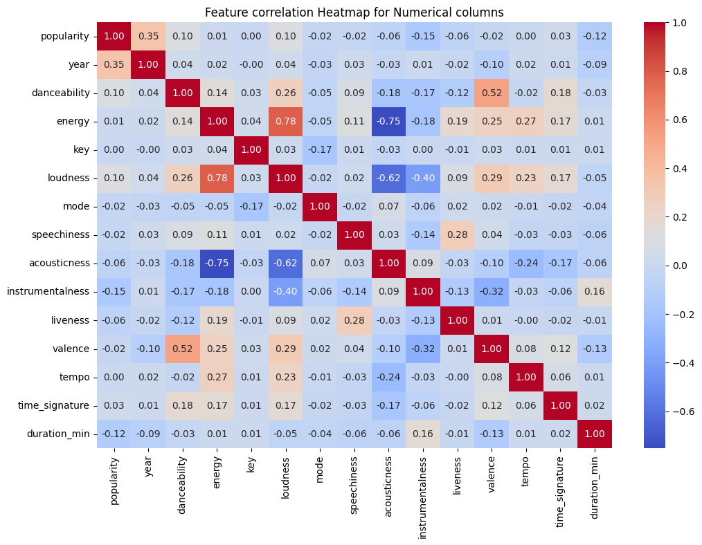
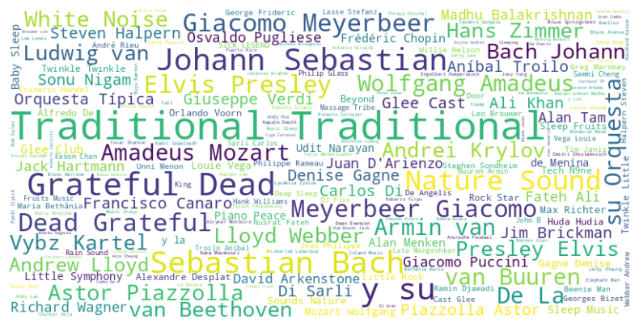
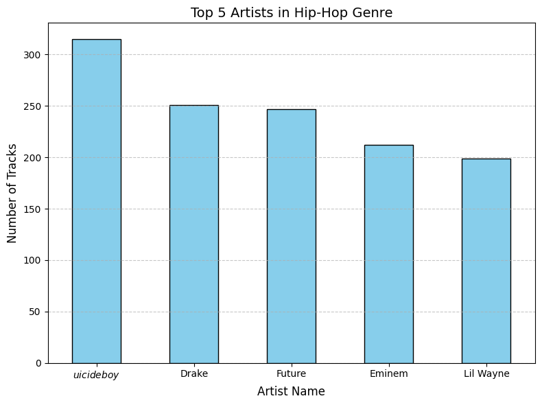
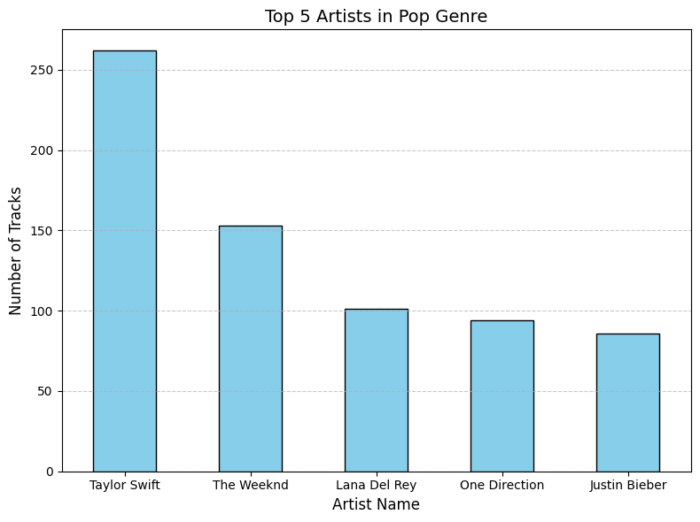

# Spotify Data Analysis

## Overview
This project involves exploring and visualizing Spotify's music dataset to uncover trends, insights, and patterns in the data. By leveraging visualizations, I aim to better understand the relationships between different features and their impact on music recommendations, popularity, and user preferences.

## Goals
1. **Understand Data Distribution:** Explore feature distributions such as song popularity, duration, tempo, and energy levels.
2. **Identify Relationships:** Analyze correlations between features like danceability, energy, and loudness.
3. **Highlight Patterns:** Showcase trends in music attributes over time.
4. **Provide Insights for Recommendations:** Use visualizations to support the rationale for building recommendation systems.

## Repository Structure
- [**Assets/**](Assets)  

- [**Reports/**](Reports)  

- [**README.md**](README.md)  

- [**SpotifyMillionSongs.ipynb**](SpotifyMillionSongs.ipynb)  

- [**SpotifyMillionSongs_Clustering.ipynb**](SpotifyMillionSongs_Clustering.ipynb)  

- [**report.html**](report.html)  
  
Find a snapshot of the PowerBi dashboard in pdf format here: [**dashboard_pdf**](Assets/Spotify_Data_Analysis.pdf) and the file here: [**dashboard**](Assets/Spotify_Data_Analysis.pbix)

## Data Description
The dataset includes features extracted from Spotify tracks. Below is a tabular representation of columns and their description

| Feature Name | Description |
| :--- | :--- |
| popularity | A measure of the song's popularity on Spotify |
| year | The year the song was released |
| genre | The primary genre of the song |
| danceability | Describes how suitable the track is for dancing |
| energy | Represents the perceived intensity and activity level of the track |
| key | The musical key of the song |
| loudness | The overall loudness of the track in decibels (dB) |
| mode | Indicates whether the track is in major (1) or minor (0) key |
| speechiness | The presence of spoken words in the track |
| acousticness | A confidence measure of whether the track is acoustic |
| instrumentalness | The presence of vocals in the track |
| liveness | A confidence measure of whether the track was performed live |
| valence | The positivity conveyed by the track |
| tempo | The average tempo of the track in beats per minute (BPM) |
| time_signature | The time signature of the track |
| duration_ms | The duration of the track in milliseconds |

## Tools and Libraries
- **Python Libraries:**
  - `pandas` for data manipulation.
  - `matplotlib` and `seaborn` for visualizations.
  - `plotly` for interactive plots.

## Key Visualizations
### 1. **Feature Distributions**
- **Goal:** Understand the distribution of individual audio features.
- **Method:** Used histograms and KDE plots to visualize distributions.
- **Insights:**
  - Popular songs tend to have high danceability and energy.
  - Acousticness has a skewed distribution, indicating most songs are not acoustic.

### 2. **Correlation Heatmap**
- **Goal:** Identify relationships between numerical features.

**Key Insights:**

- High Positive Correlations:

    - loudness and energy (0.78): Songs with higher energy tend to be louder.
    - valence and danceability (0.52): Danceable songs tend to have a positive mood.

- High Negative Correlations:
    - acousticness and energy (-0.75): Acoustic songs are less energetic.
    - instrumentalness and valence (-0.32): Instrumental songs tend to have lower valence (less positivity).
- Weak or No Correlations:
    - key has weak correlations with most features.
    - time_signature shows almost no correlation with other features.

### 3. **Trend Analysis Over Time**
- **Goal:** Examine how music features evolved over decades.
- **Method:** Line plots and scatter plots grouped by release year.
- **Insights:**
  - Loudness has steadily increased over the years.
  - Songs have become more danceable and energetic over time.

### 4. **Popularity vs. Audio Features**
- **Goal:** Determine which features influence a song’s popularity.
- **Method:** Boxplots and scatter plots of popularity scores against features.
- **Insights:**
  - Popular songs often have high valence (positivity).
  - Tempo and loudness are key factors for hit tracks.

### 5. **Genre Analysis**
- **Goal:** Explore how audio features vary across genres.
- **Method:** Bar plots and violin plots segmented by genre.
- **Insights:**
  - Classical music has high acousticness and low energy.
  - Hip-hop tracks often have high speechiness.

### 6. **Interactive Visualizations**
- **Goal:** Enable deeper exploration of individual tracks and trends.
- **Method:** Used Plotly to create interactive scatter and bar plots.
- **Features:**
  - Hover functionality for detailed track information.
  - Filters for specific genres and time ranges.
  

- The artist `Traditional` has the most songs as a single artist followed `Grateful Dead`

- Top hiphop artists are `Suicideboys`, `Drake`, `Future` and so on.

- Top Pop artists are `Taylor Swift`, `The Weeknd`, `Lana Del Rey` and so on.

---

# Conclusion

This project provides valuable insights into Spotify's music dataset, revealing key trends and patterns in audio features, genre popularity, and artist contributions. Notable findings include:

1. **Trends in Music Features**:
   - Songs with higher energy are louder, and danceable tracks are associated with positive moods (high valence).
   - Acoustic songs generally lack energy, indicating a preference for softer tones in such tracks.

2. **Genre Evolution**:
   - Ambient tracks peaked in popularity during the early 2000s, likely reflecting changing consumer preferences.
   - The dataset highlights distinct trends in popular genres over time.

3. **Artist Analysis**:
   - Certain artists like `Traditional` dominate the dataset due to a large number of traditional songs.
   - Modern hip-hop and pop artists such as `Drake`,`Taylor Swift,` and `The Weeknd` stand out as leading contributors to their genres.
These insights underline the dynamic nature of music preferences and the evolving characteristics of successful tracks.

# Recommendations

1. **For Future Analysis**:
   - Incorporate external datasets such as listener demographics or regional preferences to refine insights.
   - Explore advanced machine learning models to predict song success based on audio features.

2. **For Dataset Improvement**:
   - Address data inconsistencies such as tracks with unusually long durations, e.g. mixes and ambient music to improve analysis accuracy.
   - Supplement the dataset with metadata like listener ratings or streaming counts for richer insights.

This concludes the analysis. Feel free to explore the notebook and share feedback.

